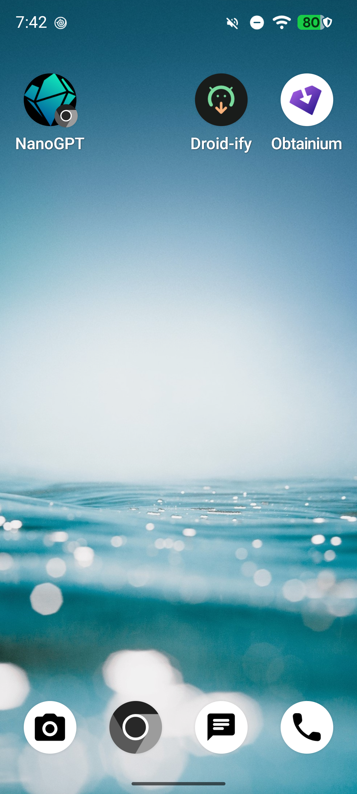

# Leafline

[](https://github.com/jdluu/Leafline/actions/workflows/ci.yml)


Leafline is a free, open-source EPUB reader for Android. It keeps your books,
highlights, and reading progress entirely on your device. The name refers to
both the leaves of a book and a continuous reading line across devices.
For fetching books from OPDS library servers, see
[ShelfSync](https://github.com/jdluu/ShelfSync), a companion sync client that
downloads and hands off EPUBs to any local reader, Leafline included.

Leafline collects no analytics, crash reports, or usage data. Everything stays
on your device except the progress sync you configure yourself against your
own server.

## Screenshots

<p align="center">
  
  
</p>

## Features

- **EPUB reading** — Read EPUB 2 and EPUB 3 books in a paginated or scrolled view
- **On-device library** — Import your own EPUB files with cover thumbnails
- **Progress sync** — Sync reading progress between your devices using any
  KOReader-compatible sync server you host yourself
- **Bookmarks & annotations** — Multi-color highlights and full-text in-book
  search
- **Customizable reading** — Adjustable fonts, themes (including sepia),
  margins, line height, tap zones, page-turn animation, and per-book brightness
- **Offline-first** — Works fully offline once books are on the device
- **No telemetry** — No analytics, crash reports, or usage data collected

**Requirements:** Android 8.0 (API 26) or newer.

## Installation

### Obtainium

[](https://apps.obtainium.imranr.dev/redirect?r=obtainium%3A%2F%2Fadd%2Fhttps%3A%2F%2Fgithub.com%2Fjdluu%2FLeafline)

Tap the badge to add Leafline to
[Obtainium](https://github.com/ImranR98/Obtainium), which installs it straight
from this repository's releases and keeps it up to date automatically.

### Manual APK

Download an APK from the [Releases](https://github.com/jdluu/Leafline/releases)
page and install it. You may need to allow installation from unknown sources.

**Note:** Leafline is pre-release. No releases are published yet; install by
building from source below.

## Building from source

Requirements: JDK 17+ and the Android SDK.

```bash
./gradlew assembleDebug        # build debug APK
./gradlew testDebugUnitTest    # run unit tests
./gradlew lintDebug            # run lint checks
```

Continuous integration runs on every pull request.

## License

[MIT](LICENSE)
